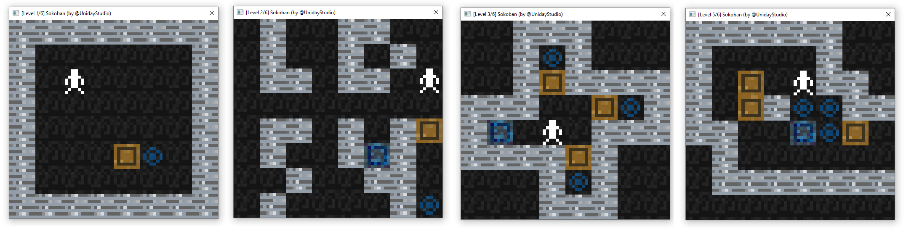
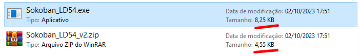

# This Game is Only 16 KB!
 A little Game I made for the Ludum Dare 54 Jam. The theme was "Limited Space", so I took it quite literally.
*(Created by Guilherme Teres, @UnidayStudio)*

### [Click Here to access the Ludum Dare Page!](https://ldjam.com/events/ludum-dare/54/$373205)

# But... WHY?

This code was put together in a few (around 3) hours to fit the theme. I had this idea to make a game with the final executable having the smallest size as possible, ideally bellow 16 KB, since I was not able to think about anything else with this theme.

Unfortunately I lost the first two days of the jam trying other (more complex) ideas, so I was not able to put this in the Compo, even making it in 3 hours. I think it would be a perfect game for the category. But I'll leave it open source anyways!

The game itself is very simple, just a **Sokoban clone** with no sound and a few levels. But it have some interesting features, such as **procedurally generated textures for the sprites and a hand drawn character pixel art using nothing but binary. :P**

Code is a bit of a mess, but given the short amount of time I had, I'm happy with it. It uses no external lib, just Windows.h, which sadly makes it window specific, but I think it would be a bit harder to make it extremely small in size and still cross platform. 

**This was my first attempt to make an executable small**, I know that there are plenty of advanced techniques out there that I'm not using and that I could same a lot more space on  stack and not using any default lib, but I'l already happy with the result. 

**It was fun to develop this little project! :)**

# Bonus: Building the Source Code

If you want to check how I manage to make it so small or even try to add new levels yourself, you can follow those steps:

In order to build this project, you must be on **Windows** and have MSVC and Make installed. Then you need to follow those steps:

- Open the Native Tools Command Prompt for VS (so you can use msvc's `cl` and `link`)
- Navigate to this project's root folder
- Type `make`

# Enjoy it!